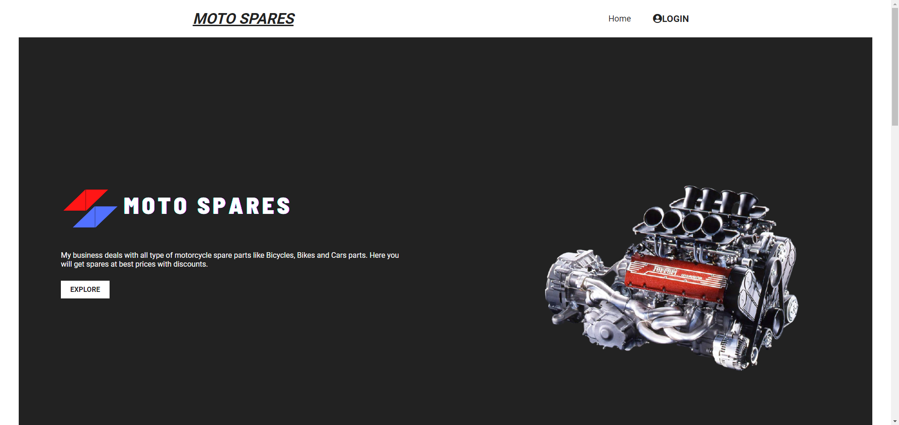
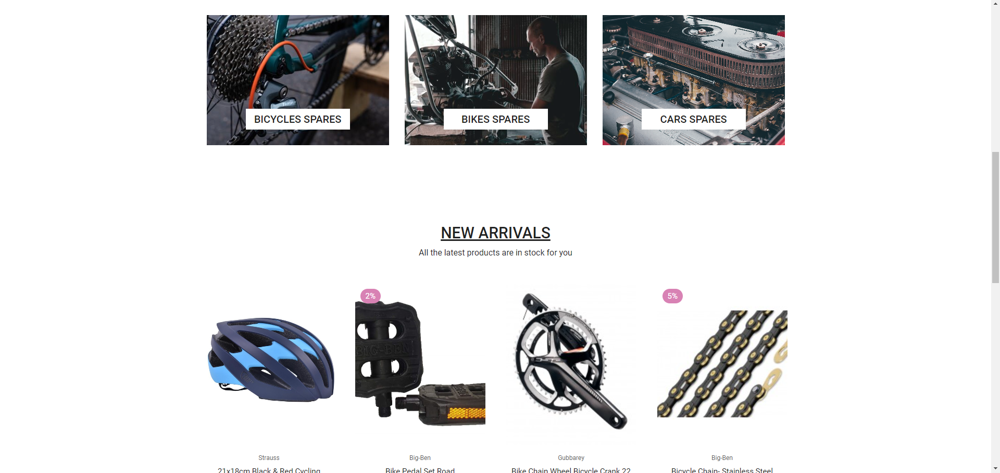
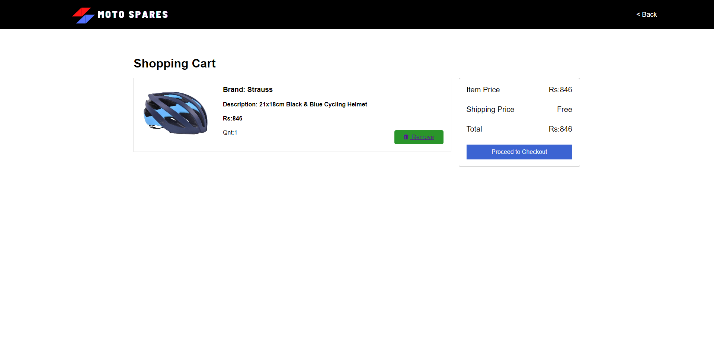
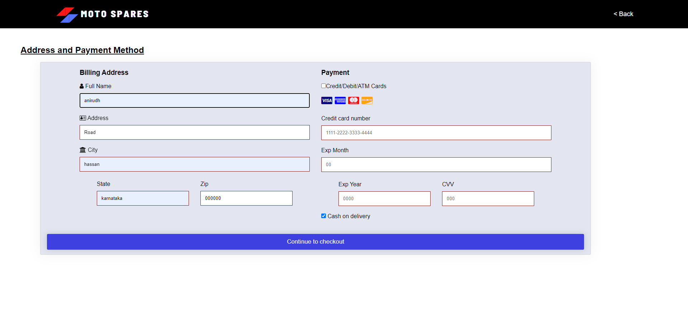
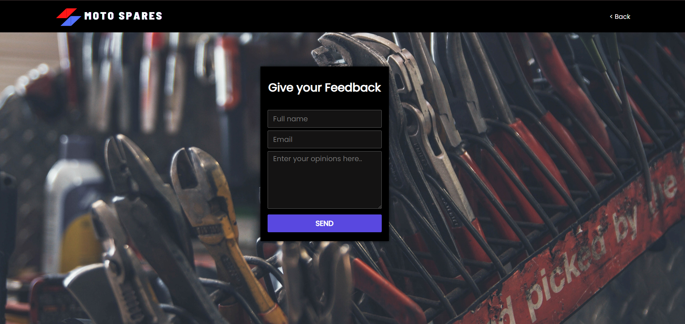
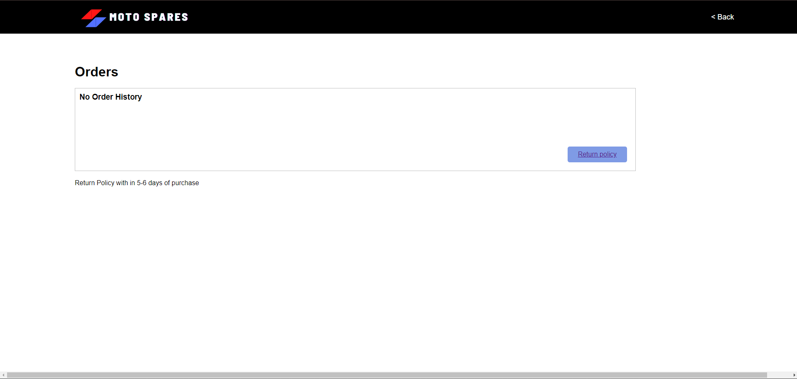

# Motospares (E-commerce Website)

Built a tool to buy spare parts of different motorcycle’s online by using HTML,
CSS, PHP, MySQL.


## Instruction to run the project: 

```bash 
git clone https://github.com/AviAcharya1/MotoSpares.git

```
## To run in local device 

- Install XAMPP

- Open XAMPP file -> htdocs

- Paste all this flies in htdocs

- Run XAMPP-control application

- Start the Apache and MySQL server

- Open any browser

- URL:- localhost/index.php

## Project is live at :
 - https://aviacharya1.github.io/MotoSpares/
## Screenshots

- First Page




- Register Page


- Item Detail


- Address and Payment


- Thankyou Page


-Feedback Page


-Cart Page


-Aboutus Page

